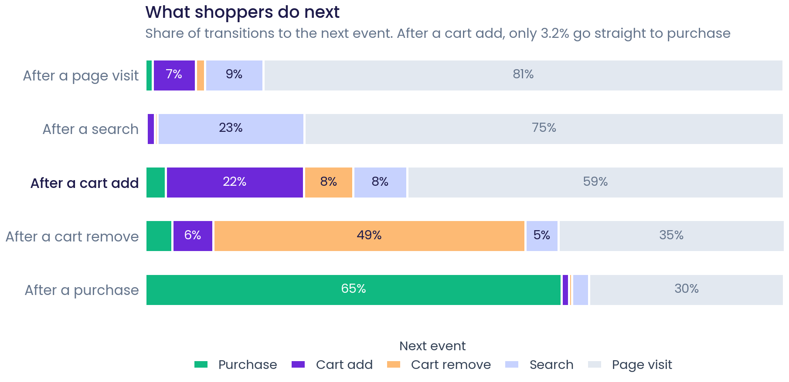
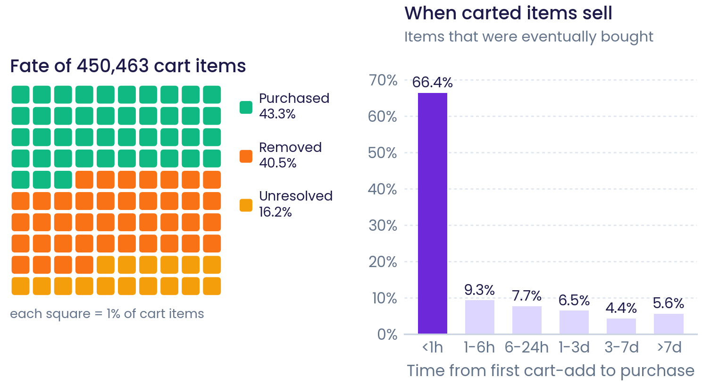
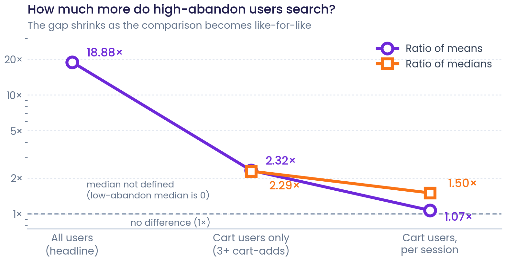
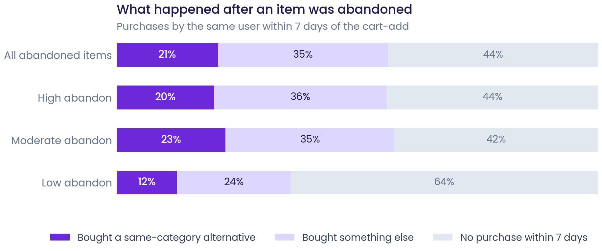
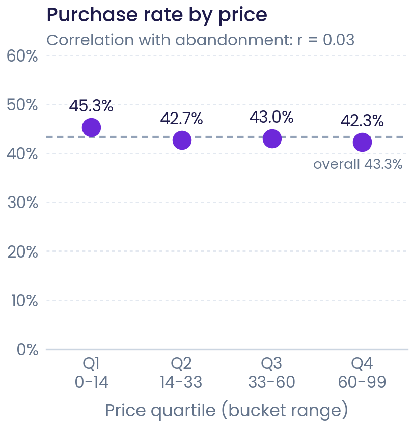
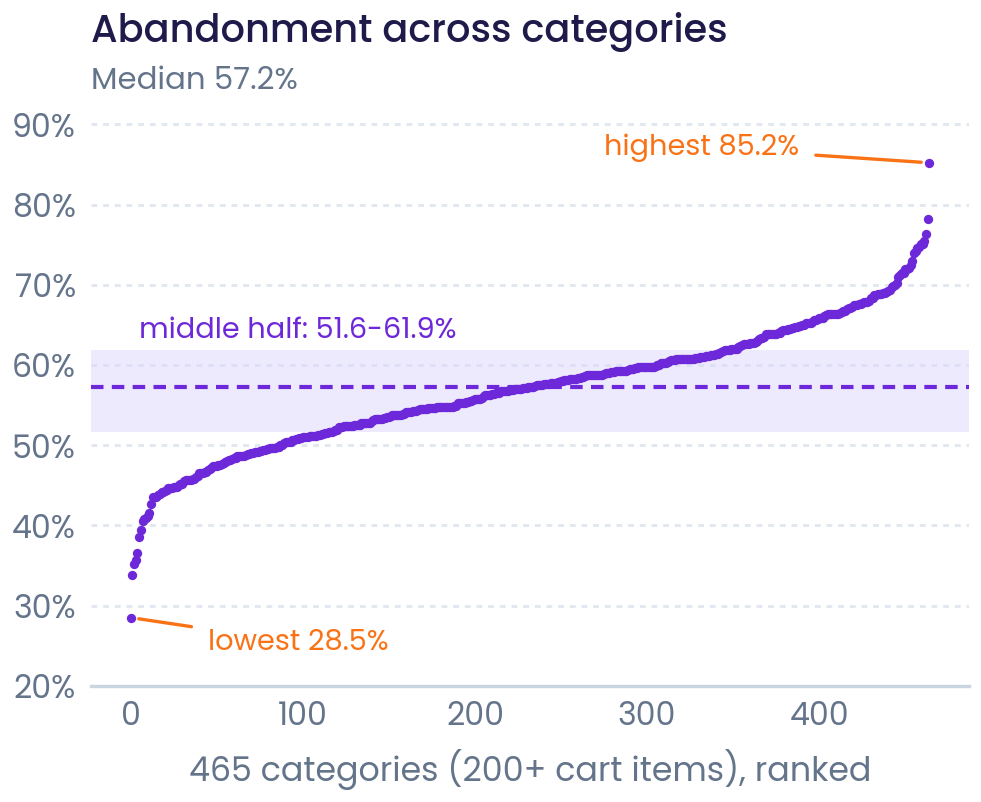
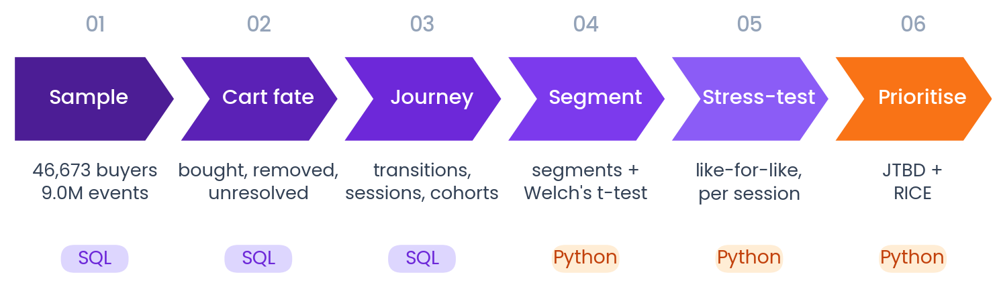
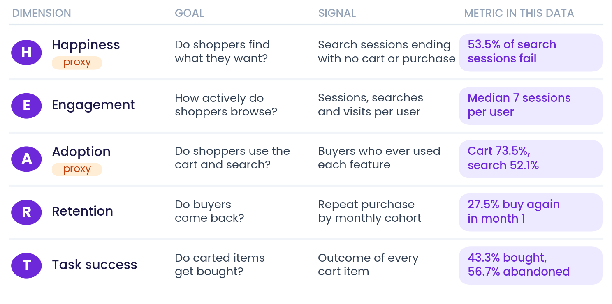

# E-Commerce Behavioral Analytics: Cart Abandonment & the User Journey

**Why do shoppers leave items in their cart, and what should the product do about it?** This project analyses 9.0 million real e-commerce events from 46,673 purchasing customers (Synerise RecSys Challenge 2025) to measure cart abandonment, map how shoppers move through the store, test what separates heavy abandoners from everyone else, and prioritise a product fix.

📄 **[Full report (PDF)](report/Ecommerce_Behavioral_Analytics_Report.pdf)** · 📓 **[Walkthrough notebook](notebooks/walkthrough.ipynb)** · 🗄️ **[SQL pipeline](sql/ecommerce_behavioral_analysis.sql)**

---

## Key findings

| | |
|---|---|
| **56.7%** | of 450,463 carted items were never bought (40.5% removed, 16.2% left unresolved); 56.2% after a censoring check |
| **3.2%** | of cart-adds are followed directly by a purchase; shoppers mostly go back to browsing |
| **18.9× → 2.3×** | how much more high-abandon users search: 18.9× across all users, 2.3× in a like-for-like comparison of cart users |
| **21%** | of abandoned items are replaced by a same-category purchase within 7 days, the clearest sign of comparison shopping |
| **r = 0.03** | correlation between price and abandonment: price is not the driver |

1. **Carting is part of browsing, not the end of it.** A journey map of event transitions shows that after adding an item, shoppers go back to browsing 59% of the time and buy next only 3.2% of the time. 77% of purchases still go through the cart first.
2. **Abandonment is broad and stable.** It sits between 52% and 59% for every monthly cohort, is flat across price quartiles, and half of all 465 categories fall between 52% and 62%.
3. **The headline RCA needed a stress test.** High-abandon users search 18.9× more than low-abandon users (Welch's t-test, p < 0.001). But half of the low-abandon group never used the cart at all. Comparing like with like (users with 3+ cart-adds), the gap is 2.3× in total, and per session it's 1.07× on average (median 0.75 vs 0.50). Heavy abandoners are mostly heavy users.
4. **Comparison shopping is real for about a fifth of abandonment.** One abandoned item in five is followed within a week by buying a different product from the same category.

**Recommendation (JTBD + RICE):** ship low-effort cart reminders first, and A/B test a comparison-shopping tool for heavy cart users, with cart-to-purchase rate as the primary metric and AOV, return rate and page speed as guardrails.

<p align="center">
  <br>
  <em>Journey map: what shoppers do after each event</em>
</p>

<p align="center">
  <br>
  <em>Fate of every cart item, and how quickly carted items that sell are bought</em>
</p>

<p align="center">
  <br>
  <em>How the search gap shrinks as the comparison gets fairer</em>
</p>

<p align="center">
  <br>
  <em>What happened in the week after an item was abandoned</em>
</p>

<p align="center">
  
  <br>
  <em>Left: purchase rate is flat across price quartiles. Right: 465 categories ranked by abandonment</em>
</p>

---

## Approach

<p align="center"></p>

| Step | What was done | Tools |
|---|---|---|
| 1. Sample & load | Client-level sample of the RecSys 2025 logs, keeping full journeys; 9.0M events loaded into DuckDB | SQL |
| 2. Cart outcomes | One row per (user, SKU) carted, de-duplicated before joining; each item labelled purchased, removed or unresolved | SQL |
| 3. Journey & cohorts | Event-transition matrix (`LEAD`), 30-minute sessions (`LAG`), first-purchase-month cohorts | SQL |
| 4. Segment & test | Abandonment and purchase-frequency segments (`NTILE`, `CASE`); Welch's t-test and Mann–Whitney U | SQL, SciPy |
| 5. Stress-test | Like-for-like cart users, per-session rates, same-category substitution test | pandas, SciPy |
| 6. Prioritise | HEART metrics, Jobs-to-be-Done framing, RICE scoring, experiment design | — |

**Metrics were chosen with Google's HEART framework.** Task success (cart-to-purchase), Engagement (sessions, searches) and Retention (cohort repeat purchase) are measured directly. The data has no surveys or feature launches, so Happiness and Adoption use behavioural proxies: Happiness as search success (53.5% of sessions with a search end with nothing carted or bought; 13.0% of cart items are removed within 10 minutes) and Adoption as feature uptake (73.5% of purchasers used the cart, 52.1% used search).

<p align="center"></p>

### Three pitfalls caught along the way
1. **Sampling bias.** Users were sampled from purchasers, so a visit → purchase funnel showed 100% purchase and stage "conversions" above 100%. The analysis was reframed around cart-item outcomes and journeys, which the sample can support.
2. **Join fan-out.** Joining raw event tables multiplied rows ~7× and produced a false 100% purchase rate in one price quartile. Fixed by de-duplicating to (user, SKU) before joining.
3. **Hidden confound.** A user with no cart-adds gets a removal rate of 0, so non-cart users landed in "low abandon" and inflated the 18.9× search gap. Surfaced by the stress test.

Details in [`docs/analysis_notes.md`](docs/analysis_notes.md).

---

## Repository structure

```
ecommerce-behavioral-analytics/
├── data/
│   └── README.md                          how the sample was built and where to get the data
├── scripts/
│   └── sample_recsys.py                   builds the client-level sample from the full dataset
├── sql/
│   └── ecommerce_behavioral_analysis.sql  full SQL pipeline, expected output under each query
├── src/
│   ├── 01_build_tables.py                 runs the SQL in DuckDB -> recsys.duckdb
│   ├── 02_analysis.py                     tests, stress test, substitution, HEART, RICE -> outputs/
│   └── 03_figures.py                      all figures (PNG + vector PDF) -> outputs/figures/
├── notebooks/
│   └── walkthrough.ipynb                  step-by-step walkthrough with outputs
├── outputs/
│   ├── results.json                       every number quoted in the report
│   ├── tables/                            CSV summaries
│   └── figures/                           charts and diagrams
├── report/
│   ├── Ecommerce_Behavioral_Analytics_Report.pdf
│   └── latex/                             LaTeX source and figures
├── docs/
│   └── analysis_notes.md                  pitfalls, definitions and decisions
├── requirements.txt
└── run_all.sh
```

## How to run

```bash
git clone https://github.com/<your-username>/ecommerce-behavioral-analytics.git
cd ecommerce-behavioral-analytics
pip install -r requirements.txt

# 1. put the six *_sample.parquet files in data/ (see data/README.md)
# 2. run the pipeline
python src/01_build_tables.py   # SQL pipeline (prints each query's result)
python src/02_analysis.py       # statistics -> outputs/results.json, outputs/tables/
python src/03_figures.py        # figures    -> outputs/figures/
```

Or `bash run_all.sh`. The pipeline runs in under a minute on a laptop.

## Data

[Synerise RecSys Challenge 2025](https://github.com/Synerise/recsys2025): anonymised, real-world interaction logs (page visits, searches, cart additions and removals, purchases). Prices are anonymised buckets, categories are IDs and search queries are embeddings. The analysis uses a client-level sample of 46,673 purchasing users (23 Jun – 8 Dec 2022); see [`data/README.md`](data/README.md).

## Limitations

- **Purchasers only**: findings describe abandonment among buying customers; no site-wide conversion rate can be computed.
- **Anonymised fields**: the analysis can't say which products, categories or search terms are involved.
- **Observational**: segment differences and substitution are associations; the recommended A/B test is what would establish impact.
- **Sample seed**: the client sample was drawn without a fixed seed, so a fresh sample would give very close but not identical numbers.

## Tools

SQL (DuckDB) · Python (pandas, NumPy, SciPy, matplotlib) · Jupyter · LaTeX · HEART, JTBD, RICE

---

*Author: Arth Dubey · Code released under the MIT License. The dataset remains under Synerise's original terms.*
